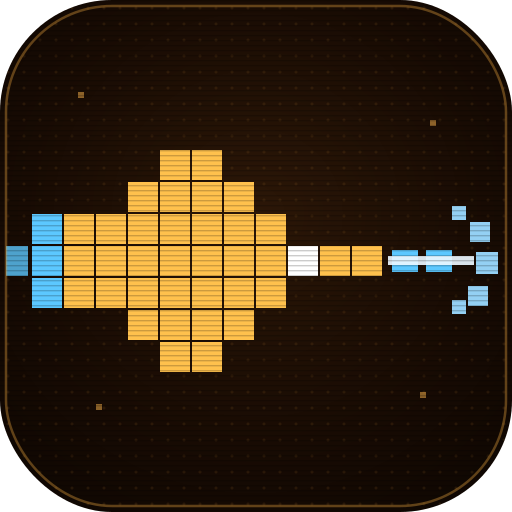

<div align="center">
  

  # Cosmo Strike

  **A retro side-scrolling shoot-'em-up — a modern remake of the classic Nokia *Space Impact*.**

  Built with Flutter + [Flame](https://flame-engine.org), wrapped in an amber-phosphor dot-matrix aesthetic.
</div>

---

## What is it

Cosmo Strike is a horizontal shmup: pilot a ship confined to the left of the screen, drag to move,
auto-fire to the right, and blast through waves of enemies and end-of-stage bosses. It ships with a
full live-service layer — leaderboards, daily challenges, weekly quests, battle pass, a Pro
subscription, achievements, tournaments, and a coin economy — backed by the companion
`cosmo-strike-dotnet-api` (.NET 10) service, which lives in its own repository.

The gameplay runs on Flame's component system; **every other part of the app** (menus, auth,
leaderboards, store, progression, theming, navigation) runs on a Flutter + Bloc/Provider/Riverpod
stack. Flame is scoped to the single gameplay screen only.

## Screenshots

> Drop image files into the [`screenshots/`](screenshots) folder using the names below and they'll
> render here automatically. (Placeholders until you add them.)

| Main Menu | Gameplay | Boss Fight |
|:---:|:---:|:---:|
|  |  |  |
| **Game Over** | **Leaderboard** | **Daily Challenges** |
|  |  |  |
| **Battle Pass** | **Store** | **Profile** |
|  |  |  |
| **Settings & Themes** | | |
|  | | |

## Gameplay (Flame engine)

Scoped to `lib/game/` and embedded via a single `GameWidget` on the gameplay screen:

- **Player** — drag-to-move (bounded to the left third) + auto-fire; optional tap/hold to fire.
  Weapon modes: single, rapid, spread, laser. Shield power-up.
- **Enemies** — four movement patterns (straight, sine-wave, dive, player-tracking), each with
  HP / speed / point value and firing behaviour.
- **Bosses** — one per stage with an HP bar and alternating attack patterns (radial spray + aimed
  burst).
- **Power-ups** — rapid-fire, spread, laser, shield, extra life, screen-clear bomb, score multiplier.
- **Flow** — wave → wave → boss per stage, ramping difficulty; pause / stage-clear / game-over
  overlays; scrolling parallax starfield; particle explosions; scoring (kills + wave/boss/survival
  bonuses).
- **Placeholder art** — the game is fully playable on programmatic geometric/vector sprites. Real
  art + audio to commission are listed in [`ASSETS_NEEDED.md`](ASSETS_NEEDED.md).

On game over the run is submitted to the backend (`/scores`) — high score, leaderboards,
achievements server-side; coins + battle-pass XP client-side.

## Architecture

```
lib/
├── main.dart                 # Boot: Firebase, GetIt DI, providers, router, sync engine
├── game/                     # Flame shmup (gameplay screen only)
│   ├── cosmo_strike_game.dart    # FlameGame: spawning, scoring, lives, stage flow
│   ├── cosmo_palette.dart        # Amber gameplay palette
│   └── components/               # player, enemies, boss, bullets, power-ups, starfield, explosions
├── presentation/bloc/        # Cubits: auth, theme, game, coins, premium, battle pass, power-up, ...
├── providers/                # Riverpod providers (leaderboards, daily challenges, walkthrough)
├── screens/                  # Menus, auth, leaderboards, store, battle pass, profile, settings, ...
│   └── gameplay_screen.dart      # Hosts the Flame GameWidget + HUD + overlays
├── services/                 # api_service (HTTP+JWT), auth, purchases, sync engine, FCM, analytics
├── data/                     # Drift database + DAOs (offline-first), datasources
├── models/                   # Domain models
├── router/                   # go_router routes + transitions
└── utils/                    # constants (GameTheme/GameMode), typography, logger
```

**State management** is a deliberate hybrid mirrored from the reference architecture:
`flutter_bloc` (primary cubits) + `provider` (services) + `flutter_riverpod` (secondary) +
`get_it` (DI), with **Drift** for an offline-first outbox sync engine.

**Key packages:** `flame` / `flame_audio`, `firebase_core/auth/messaging/analytics`,
`google_sign_in`, `in_app_purchase`, `go_router`, `drift`, `talker`, `flutter_local_notifications`.

## Theming

The app supports multiple **swappable themes** via `ThemeCubit`. The default shipped theme is
**Amber Phosphor**, seeded from the logo palette:

| Token | Hex |
|---|---|
| Hull / primary (amber) | `#ffc14d` (dark `#ff9e2c`, light `#ffb74d`) |
| Accent / energy (electric blue) | `#5cc8ff` |
| Highlight (icy white) | `#eaf6ff` |
| Backgrounds (warm dark) | `#0a0501` · `#180b03` · `#2c1707` |
| Grid / muted | `#8a5a22` |

Additional themes remain selectable through the same mechanism.

## Getting started

```bash
flutter pub get

# Generate Drift code (offline-first DB) — required once / after schema changes
dart run build_runner build --delete-conflicting-outputs

flutter analyze     # must be clean
flutter run
```

### Configuration

Two things are **not committed** (gitignored) and must be provided locally:

1. **`.env`** at the app root:
   ```env
   DEV_API_BACKEND_URL=http://localhost:8493
   PROD_API_BACKEND_URL=https://cosmostrike.pranta.dev
   GOOGLE_WEB_CLIENT_ID=<your-web-client-id>.apps.googleusercontent.com
   ```
2. **Firebase config** — `firebase_options.dart`, `android/app/google-services.json`,
   `ios/Runner/GoogleService-Info.plist`. Connect the app to your Firebase project with FlutterFire;
   these files are intentionally gitignored.

### Branding

The launcher icon and native splash are wired to the logo at
`assets/logo/cosmo_strike_icon_512_amber.png` via `flutter_launcher_icons.yaml` and
`flutter_native_splash.yaml`. Regenerate with:

```bash
dart run flutter_launcher_icons
dart run flutter_native_splash:create
```

## Backend

Score submission, leaderboards, progression, and subscription verification are served by the
`cosmo-strike-dotnet-api` service, which lives in its own repository.
