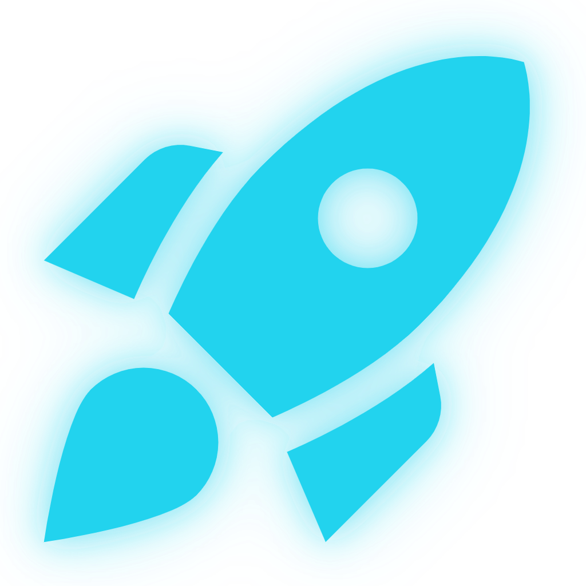

<div align="center">
  

  # Cosmo Strike

  **A neon sci-fi shoot-'em-up — a choreographed space-combat campaign for mobile.**

  Built with Flutter + [Flame](https://flame-engine.org), wrapped in a sleek
  "Command HUD" aesthetic. Landscape-only, fully playable offline.
</div>

---

## What is it

Cosmo Strike is a horizontal shmup: pilot a starfighter through a **12-level
choreographed campaign** across four alien biomes, chaining combos and downing
multi-phase bosses. Game modes (Classic, Time Attack, Survival, Onslaught, and
more) layer on top as modifiers. It ships with a full live-service layer —
leaderboards, daily challenges, weekly quests, a battle pass, achievements, a
coin economy, ads, and a Pro subscription — backed by the companion
`cosmo-strike-dotnet-api` (.NET 10) service in its own repository.

The gameplay runs on Flame's component system; **every other part of the app**
(menus, auth, leaderboards, store, progression, theming, navigation) runs on a
Flutter + Bloc/Provider/Riverpod stack. Flame is scoped to the single gameplay
screen only.

> ⚠️ **Landscape only.** The app is locked to `sensorLandscape` and runs
> fullscreen immersive. Every screen is designed for a wide, short viewport.

## Screenshots

> Drop landscape image files into the [`screenshots/`](screenshots) folder using
> the names below and they'll render here automatically. (Placeholders until you
> add them.)

| Main Menu | Level Select |
|:---:|:---:|
|  |  |
| **Gameplay** | **Boss Fight** |
|  |  |
| **Pause — Mission Console** | **Game Over — Debrief** |
|  |  |
| **Daily Challenges** | **Leaderboard** |
|  |  |
| **Battle Pass** | **Store** |
|  |  |

## Gameplay (Flame engine)

Scoped to `lib/game/` and embedded via a single `GameWidget` on the gameplay
screen:

- **Choreographed levels** — each level is a `LevelScript` timeline
  (formations, drops, telegraphed set-pieces, boss events) with relative delays
  and barrier events that wait for a clear field. 12 levels across 4 biomes.
- **Formations** — 9 spawn shapes (stream, v-wedge, snake-chain, pincer,
  wall-with-gap, column-dive, ambush-rear, ring-spinner, escort-convoy); wiping
  one fast pays a bonus + drops an orb.
- **Combo + graze** — kill chains drive a ×1–×4 score multiplier (breaks on a
  landed hit); grazing enemy bullets up close charges a meter that grants +1
  missile.
- **Bosses** — per-type multi-phase kits where **every attack telegraphs**; a
  phase flip clears boss bullets, flashes, and hit-stops.
- **Terrain is gameplay** — animated floor/ceiling bands squeeze into corridors
  during set-pieces; turrets mount the terrain.
- **Power-ups** — weapon upgrades, shield, speed, slow-mo, magnet, ghost, plus a
  screen-clear bomb and score multiplier.
- **Modes** — Classic, Zen, Speed Challenge, Onslaught, Survival, Time Attack,
  Power-Up Madness, Perfect Game — modifiers layered on the campaign.
- **Controls** — relative drag-to-steer + auto-fire, double-tap to fire a
  missile, optional on-screen D-pad (settings-driven). One revive per run
  (rewarded ad or 200 coins).

Sprites and SFX are bundled and preloaded; the run feeds the live-service layer
(coins, battle-pass XP, daily challenges, achievements) on completion.

## Architecture

```
lib/
├── main.dart                 # Boot: Firebase, GetIt DI, providers, router, sync engine
├── game/                     # Flame shmup (gameplay screen only)
│   ├── cosmo_strike_game.dart    # FlameGame: state machine, scoring, lives, level flow
│   ├── cosmo_palette.dart        # Neon gameplay palette (cyan hull / magenta hostiles)
│   ├── levels/                   # LevelScript, ScriptRunner, formations, level catalog
│   ├── components/               # player, enemies, bosses, bullets, power-ups, terrain, fx
│   └── combo_graze.dart          # combo multiplier + graze meter
├── presentation/bloc/        # Cubits: auth, theme, game settings, coins, premium, battle pass, ...
├── providers/                # Riverpod providers (leaderboards, daily challenges, walkthrough)
├── screens/                  # Menus, auth, level select, leaderboards, store, battle pass, ...
│   └── gameplay_screen.dart      # Hosts the Flame GameWidget + HUD + pause/game-over overlays
├── ui/                       # "Command HUD" design system (barrel: ui/design.dart)
├── widgets/                  # Shared widgets/overlays (reward toast, gameplay overlays, ...)
├── services/                 # api_service, auth, purchases, ads, analytics, sync engine, FCM
├── data/                     # Drift database + DAOs (offline-first), datasources
├── models/                   # Domain models
├── router/                   # go_router routes + transitions
└── utils/                    # constants (GameTheme/GameMode), campaign catalog, logger
```

### Offline-first (Drift is the source of truth)

The client's **local Drift database is authoritative** and the game is fully
playable offline:

- **Reads** come from Drift, never directly from the API.
- **Writes** are local-first + queued: a user action writes to Drift and
  enqueues an outbox item; `SyncEngine` pushes batches to the backend with
  retry/backoff when online.
- **Pull happens exactly once, on first sign-in**, to hydrate a fresh device.
  After that the device never bulk-pulls again — local progress is authoritative.

**State management** is a deliberate hybrid: `flutter_bloc` (primary cubits) +
`provider` (services) + `flutter_riverpod` (secondary) + `get_it` (DI), with
**Drift** for the offline-first outbox sync engine.

**Key packages:** `flame` / `flame_audio` / `flutter_soloud`, `firebase_core` /
`auth` / `messaging` / `analytics`, `google_sign_in`, `in_app_purchase`,
`google_mobile_ads`, `go_router`, `drift`, `talker`,
`flutter_local_notifications`.

## Design system — "Command HUD"

Sleek sci-fi neon: deep-indigo/near-black base, neon **cyan + magenta** accents,
glassmorphic panels, and a custom-painted deep-space background (gradient +
nebulae + sun/planets/moon + a drifting parallax starfield & comet). The system
lives in `lib/ui/` (barrel `lib/ui/design.dart`): `CommandScaffold`, `GlassPanel`
/ `HoloCard`, `NeonButton`, `HudChip`, `StarfieldBackground`, `GameTokens`.

Themes are swappable via `ThemeCubit`; the default skin is **Command Cyan**, with
additional neon skins selectable in Settings. Per-skin color tokens
(`neonPrimary`, `neonSecondary`, `glow`, `surface`, `textPrimary`, …) live on
`GameTheme` in `lib/utils/constants.dart`.

## Getting started

```bash
flutter pub get

# Generate Drift code (offline-first DB) — required once / after schema changes
dart run build_runner build --delete-conflicting-outputs

flutter analyze     # must be clean
flutter run
```

### Configuration

Two things are **not committed** (gitignored) and must be provided locally:

1. **`.env`** at the app root:
   ```env
   DEV_API_BACKEND_URL=http://localhost:8493
   PROD_API_BACKEND_URL=https://cosmostrike.pranta.dev
   GOOGLE_WEB_CLIENT_ID=<your-web-client-id>.apps.googleusercontent.com
   ```
2. **Firebase config** — `firebase_options.dart`,
   `android/app/google-services.json`, `ios/Runner/GoogleService-Info.plist`.
   Connect the app to your Firebase project with FlutterFire; these files are
   intentionally gitignored.

### Branding

The launcher icon and native splash are wired through the standalone
`flutter_launcher_icons.yaml` and `flutter_native_splash.yaml` (these override
pubspec — keep icon/splash config only there). Regenerate with:

```bash
dart run flutter_launcher_icons
dart run flutter_native_splash:create
```

> ⚠️ `flutter_native_splash:create` rewrites `AndroidManifest.xml` and **strips
> `android:screenOrientation="sensorLandscape"`** from `MainActivity` — re-add it
> after every regeneration or the app boots in portrait.

## Release (Play Store)

Release builds sign with the upload keystore via a gitignored
`android/key.properties` (the keystore itself lives outside the repo). Build the
Play bundle with:

```bash
flutter build appbundle --release   # -> build/app/outputs/bundle/release/app-release.aab
```

## Backend

Leaderboards, score validation, progression sync, social, and subscription
verification are served by the `cosmo-strike-dotnet-api` (.NET 10) service, which
lives in its own repository.
